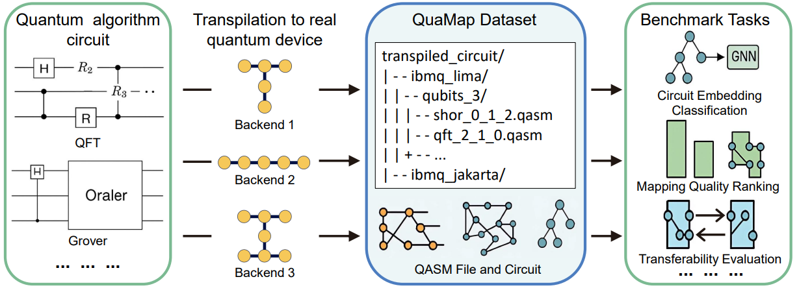

# QuaMap: A Multi-Backend Benchmark Dataset for Quantum Circuit Mapping and Learning-Based Compiler Evaluation

QuaMap is the first large-scale, **open-source benchmark dataset** that links 75 quantum algorithms with over **210,000 hardware-aware transpiled circuits** across **10 IBM Quantum backends**. It enables **learning-based evaluation** of quantum circuit transpilation, with rich performance metrics and standardized benchmark tasks such as **layout ranking**, **transpilation metric prediction**, and **cross-device transferability analysis**.

<p align="center">
  
</p>
<p align="center"><b>Figure:</b> QuaMap captures the backend-specific effects of circuit mapping across devices and layouts.</p>

## Key Features

* **Multi-Device Transpilation**

  * Transpiled circuits over 10 real IBM Quantum devices, covering 3 distinct hardware topologies.

* **Layout Enumeration**

  * Exhaustive mapping of logical qubits to physical qubits for 3–7 qubit circuits.

* **Rich Circuit Metrics**

  * Includes depth, CX count, gate counts (1Q, 2Q, multi-Q), layout info, and source/mapped QASM.

* **Standardized Benchmark Tasks**

  * Circuit classification, depth/gate/CX prediction, layout ranking, and transferability across backends.

* **Learning-Based Baselines**

  * GNNs, MLPs, Transformers, and tree-based methods for all benchmark tasks.

* **Open and Reproducible**

  * All data, code, metrics, and baselines are publicly available.

## Dataset Structure

```
QuaMap/
├── origin_circuit/               # Original OpenQASM circuits grouped by logical qubit count
│   └── qubits_3/
│       └── grover_3.qasm
├── transpiled_circuit/          # Transpiled circuits grouped by backend and qubit count
│   └── ibmq_lima/
│       └── qubits_3/
│           └── grover_0_1_2.qasm
├── metrics/                     # JSON files storing structural/performance metadata
│   └── grover_0_1_2.json
├── fig/                         # Figures used in paper and documentation
├── tasks/                       # Scripts and baseline models for benchmark tasks
│   ├── classification/
│   ├── prediction/
│   └── ranking/
├── utils/                       # QASM parsers, layout enumeration, etc.
└── README.md
```

## Requirements

```bash
pip install qiskit
pip install networkx
pip install numpy
pip install matplotlib
pip install scikit-learn
pip install xgboost
pip install torch
pip install dgl
```

*Requires:*

* Python 3.8+
* Access to IBM Quantum devices (via Qiskit)
* Optional: CUDA-enabled GPU for GNN/Transformer training


## Getting Started

```bash
# Clone the repo
git clone https://github.com/Secbrain/QuaMap.git
cd QuaMap

# Run a GNN-based circuit classifier
cd tasks/classification
python run_gnn_classifier.py --backend ibmq_lima --qubits 3

# Predict post-transpilation metrics
cd ../prediction
python predict_metrics.py --backend ibmq_jakarta

# Rank candidate layouts for a given circuit
cd ../ranking
python rank_layouts.py --circuit ./origin_circuit/qubits_5/qft.qasm
```

## Benchmark Tasks

| Task                       | Description                                                      |
| -------------------------- | ---------------------------------------------------------------- |
| **Circuit Classification** | Identify algorithm category from transpiled structure using GNNs |
| **Metric Prediction**      | Predict circuit depth, CX count, gate count pre-transpilation    |
| **Mapping Ranking**        | Rank layout candidates by expected circuit quality               |
| **Transferability**        | Evaluate fidelity degradation across different devices           |


## References

- [Qiskit](https://www.ibm.com/quantum/qiskit),  - IBM Quantum Computing
- [IBM Quantum](https://quantum-computing.ibm.com/),  - IBM Quantum
- [t|ket⟩: a retargetable compiler for NISQ devices](https://dl.acm.org/doi/abs/10.1145/3397166.3409141), 	Sivarajah S, Dilkes S, et al. - Quantum Science and Technology 2020
