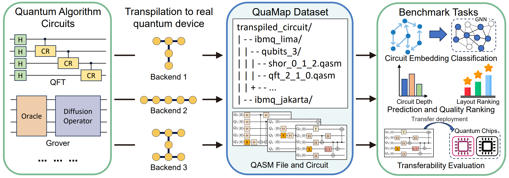

[](https://doi.org/10.5281/zenodo.18154916)

# QuaMap: A Multi-Backend Benchmark Dataset for Quantum Circuit Mapping and Learning-Based Compiler Evaluation

QuaMap is the large-scale, **open-source dataset** that links 75 quantum algorithms with over **210,000 hardware-aware transpiled circuits** across **IBM Quantum backends**. It enables **learning-based evaluation** of quantum circuit transpilation, with rich performance metrics and standardized benchmark tasks such as **layout ranking**, **transpilation metric prediction**, and **cross-device transferability analysis**.

<p align="center">
  
</p>
<p align="center"><b>Figure:</b> QuaMap captures the backend-specific effects of circuit mapping across devices and layouts.</p>

## Key Features

* **Multi-Device Transpilation**

  * Transpiled circuits over a series of real IBM Quantum devices, covering 3 distinct hardware topologies.

* **Layout Enumeration**

  * Exhaustive mapping of logical qubits to physical qubits for 3-7 qubit circuits.

* **Rich Circuit Metrics**

  * Includes depth, CX count, gate counts (1Q, 2Q, multi-Q), layout info, and source/mapped QASM.

* **Standardized Benchmark Tasks**

  * Circuit classification, depth/gate/CX prediction, layout ranking, and transferability across backends.

## Dataset Structure

```
QuaMap/
├── origin_circuit/               # Original OpenQASM circuits grouped by logical qubit count
│   └── qubits_3/
│       └── grover_3.qasm
├── transpiled_circuit/          # Transpiled circuits grouped by backend and qubit count
│   └── ibmq_lima/
│       └── qubits_3/
│           └── grover_0_1_2.qasm
├── metrics/                     # JSON files storing structural/performance metadata
│   └── grover_0_1_2.json
├── fig/                         # Figures used in paper and documentation
└── README.md
```

## Requirements

```bash
pip install qiskit
pip install networkx
pip install numpy
pip install matplotlib
pip install scikit-learn
pip install xgboost
pip install torch
pip install dgl
```

## Getting Started

```bash
# Clone the repo
git clone https://github.com/Secbrain/QuaMap.git
cd QuaMap

# Print metrics
python test.py
```

## References

- [Qiskit](https://www.ibm.com/quantum/qiskit),  - IBM Quantum Computing
- [IBM Quantum](https://quantum-computing.ibm.com/),  - IBM Quantum
- [MindSpore Quantum: a user-friendly, high-performance, and AI-compatible quantum computing framework](https://arxiv.org/abs/2406.17248),  - MindSpore Quantum
- [t|ket⟩: a retargetable compiler for NISQ devices](https://dl.acm.org/doi/abs/10.1145/3397166.3409141), 	Sivarajah S, Dilkes S, et al. - Quantum Science and Technology 2020
